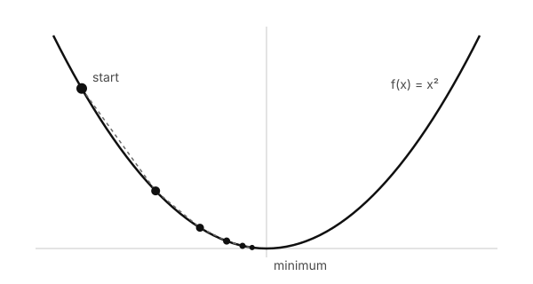
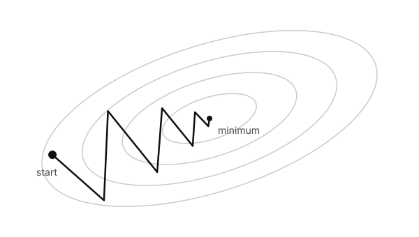
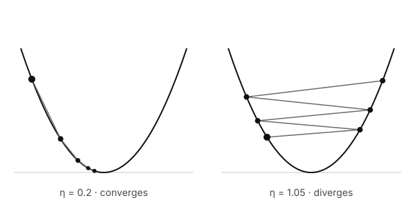

Almost every model you have heard of — from a humble linear regression to a large language model — is trained by the same idea: *look at the slope, and take a small step downhill*. This post builds that idea from scratch.

## The landscape

Start with the simplest possible loss, $f(x) = x^2$. Its lowest point is obviously at $x = 0$, but pretend we cannot see the whole curve. All we can do is stand somewhere and feel the slope under our feet, which is the derivative $f'(x) = 2x$.

<figure>
  
  <figcaption>Each dot is one step. The steps shrink on their own as the slope flattens out.</figcaption>
</figure>

If the slope is positive, the bottom is to the left; if it is negative, the bottom is to the right. So we move *against* the slope.

## The update rule

For a model with parameters $\theta$ and a loss $L(\theta)$, one step of gradient descent is

$$
\theta_{t+1} = \theta_t - \eta \, \nabla L(\theta_t)
$$

where $\eta$ is the **learning rate** — how big a step we are willing to take. For a regression model the loss is usually the mean squared error over $n$ examples:

$$
L(\theta) = \frac{1}{n} \sum_{i=1}^{n} \left( y_i - \theta^\top x_i \right)^2
$$

and its gradient has a pleasingly simple form:

$$
\nabla L(\theta) = -\frac{2}{n} \sum_{i=1}^{n} \left( y_i - \theta^\top x_i \right) x_i
$$

## Why a small step works

Why should stepping against the gradient reduce the loss at all? Expand $L$ around the current point with a second-order Taylor series:

$$
L(\theta - \eta g) \approx L(\theta) - \eta \, \lVert g \rVert^2 + \frac{\eta^2}{2} \, g^\top H g
$$

where $g = \nabla L(\theta)$ and $H$ is the Hessian. The middle term is always negative, so for a small enough $\eta$ the loss goes down. The last term is the warning label: make $\eta$ too large and the curvature wins.

> Gradient descent never sees the whole mountain. It only ever asks one question: *which way is down from here?*

## In two dimensions

Real losses have many parameters. With two, we can draw the loss as contour lines, like a hiking map. Long, narrow valleys are common, and there the gradient points mostly *across* the valley rather than along it — so the path zig-zags.



## Choosing the learning rate

On $f(x) = x^2$ the update becomes $x_{t+1} = (1 - 2\eta)\,x_t$. That tells us everything:

- $0 < \eta < 0.5$: the steps shrink smoothly towards zero.
- $0.5 < \eta < 1$: it overshoots, but still converges.
- $\eta > 1$: $|1 - 2\eta| > 1$, and every step lands further away than the last.

<figure>
  
  <figcaption>Same function, same start. Only the learning rate differs.</figcaption>
</figure>

## The whole thing in code

```python
def gradient_descent(grad, x0, lr=0.1, steps=50):
    """Minimise a function given its gradient."""
    x = x0
    for _ in range(steps):
        x = x - lr * grad(x)
    return x

# f(x) = x^2  →  f'(x) = 2x
print(gradient_descent(lambda x: 2 * x, x0=-2.6, lr=0.2))  # ≈ 0.0
```

Everything else — momentum, Adam, learning-rate schedules — is a refinement of these five lines.
