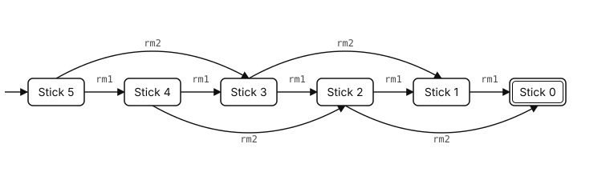
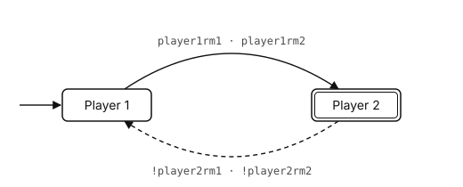
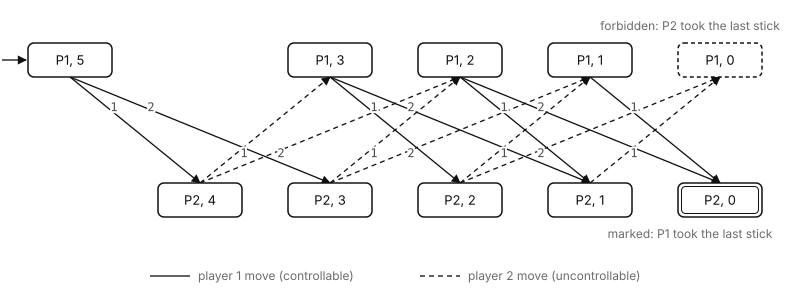
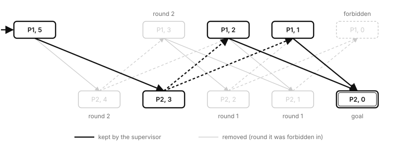
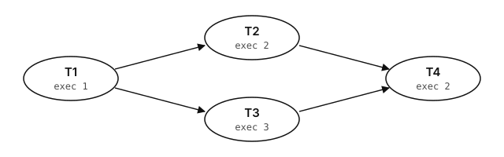
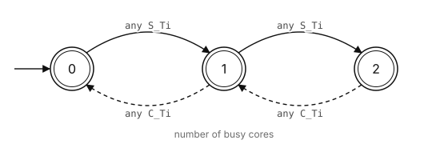

Some systems don't change smoothly over time. They jump. A machine on a factory floor is *idle*, then *working*, then *broken down*. A packet is *queued*, then *sent*, then *acknowledged*. Nothing interesting happens between those jumps; everything happens *at* them.

These are **discrete event systems** (DES), and they were the subject of my final year project at the College of Engineering Trivandrum. This post walks through the modelling side of that work: how to describe such a system, how to combine small models into big ones, and how to automatically build a controller that keeps the system safe. We'll start with a game you can play with five matchsticks, and end with scheduling real-time tasks on a multi-core processor.

## What a discrete event system is

A DES is described by a set of states and the events that move it between them. Formally, we model it as a finite automaton:

$$
G = (Q,\ \Sigma,\ \delta,\ q_0,\ Q_m)
$$

- $Q$ is the set of states the system can be in.
- $\Sigma$ is the alphabet of events that can happen.
- $\delta : Q \times \Sigma \to Q$ is the transition function. $\delta(q, \sigma) = q'$ means "if event $\sigma$ happens in state $q$, we move to $q'$". It is *partial*: not every event is possible in every state.
- $q_0$ is the initial state.
- $Q_m \subseteq Q$ are the **marked** states, the ones that mean "a task was completed successfully". In the diagrams below they have a double border.

That is the entire vocabulary. Everything in this post is built out of it.

## Controllable and uncontrollable events

The idea that makes DES useful for control comes from Ramadge and Wonham's **Supervisory Control Theory** (1987). It splits the events into two kinds:

$$
\Sigma = \Sigma_c \,\cup\, \Sigma_{uc}, \qquad \Sigma_c \cap \Sigma_{uc} = \varnothing
$$

**Controllable** events $\Sigma_c$ are ones we are allowed to block: starting a machine, sending a packet, making a move. **Uncontrollable** events $\Sigma_{uc}$ just happen: a machine breaks down, a timer ticks, an opponent moves.

A **supervisor** is a controller that watches the events as they occur and, in each state, decides which controllable events to allow. It can never block an uncontrollable one. Its job is to restrict the system just enough that it stays out of bad states and can always still reach a marked one, and to restrict it no more than that.

## A toy problem: the stick-picking game

Here is the example we used throughout the project. Five sticks lie on a table. Two players take turns, and on each turn a player removes either one or two sticks. Whoever takes the last stick wins.

We are player 1. Our moves are the events we control; the opponent's moves are not. Following the convention we used in the project, uncontrollable events are written with a leading `!`:

| Event | Meaning | Kind |
| --- | --- | --- |
| `player1rm1`, `player1rm2` | we remove 1 or 2 sticks | controllable |
| `!player2rm1`, `!player2rm2` | the opponent removes 1 or 2 sticks | uncontrollable |

Rather than modelling the whole game at once, we model its two concerns separately.

The **stick automaton** tracks how many sticks are left. It starts at five and moves down by one or two with every move, whoever makes it. `rm1` below stands for either player removing one stick, and `rm2` for either player removing two. Stick 0 is marked: the game is over.

<figure>
  
  <figcaption>The stick automaton. It doesn't know or care whose turn it is.</figcaption>
</figure>

The **player automaton** tracks whose turn it is. Player 1's moves hand the turn to player 2, and player 2's moves hand it back. Player 2 is marked, because if the game ends while it is player 2's turn, player 1 made the last move.

<figure>
  
  <figcaption>The player automaton. Dashed edges are uncontrollable.</figcaption>
</figure>

Neither model knows about the other. That separation is deliberate: small models are easy to get right.

## Putting models together: parallel composition

To get the whole game, we run the two automata side by side with **parallel composition**, written $G_1 \parallel G_2$. The composed state is a pair $(x_1, x_2)$, and an event moves it like this:

$$
\delta\big((x_1, x_2), \sigma\big) =
\begin{cases}
\big(\delta_1(x_1, \sigma),\ \delta_2(x_2, \sigma)\big) & \text{if } \sigma \in \Sigma_1 \cap \Sigma_2 \text{ and both are defined} \\
\big(\delta_1(x_1, \sigma),\ x_2\big) & \text{if } \sigma \in \Sigma_1 \setminus \Sigma_2 \\
\big(x_1,\ \delta_2(x_2, \sigma)\big) & \text{if } \sigma \in \Sigma_2 \setminus \Sigma_1 \\
\text{undefined} & \text{otherwise}
\end{cases}
$$

Shared events must happen in both models at once, so each model can veto them. Private events move only their own model. In our game every event is shared, so a move is only possible when it is the right player's turn *and* there are enough sticks left.

The product could have $2 \times 6 = 12$ states, but only 10 are reachable from the start:

<figure>
  
  <figcaption>Player ∥ Stick. The top row is player 1 to move, the bottom row player 2. Numbers on the edges are sticks removed.</figcaption>
</figure>

Two end states matter. $(\text{P2}, 0)$ is marked: we took the last stick. $(\text{P1}, 0)$ is **forbidden**: the opponent did. The question for the supervisor is now precise. Which of our moves should we disallow so that, *whatever the opponent does*, we can never land in $(\text{P1}, 0)$ and can always still reach $(\text{P2}, 0)$?

## Synthesising the supervisor

We computed the supervisor with the **Safe-State-Synthesis** algorithm, which produces the *maximally permissive* supervisor: the one that blocks as little as possible while still guaranteeing safety.

It takes the forbidden states $Q_x$, the marked states $Q_m$ and the plant, and repeats three steps until nothing changes:

1. **Restricted-Backward.** Starting from the marked states, walk edges backwards and collect every state that can still reach a marked state without passing through a forbidden one. Call this set $Q'$. Anything *outside* $Q'$ is a dead end.
2. **Uncontrollable-Backward.** From the dead ends, walk backwards along *uncontrollable* edges only. Any state that can be pushed into a dead end by events we can't block is itself unsafe. Call this set $Q''$.
3. **Update** the forbidden set and check for a fixed point:

$$
Q_x^{\,i} = Q_x^{\,i-1} \cup Q'', \qquad \text{stop when } Q_x^{\,i} = Q_x^{\,i-1}
$$

Finally, **Restricted-Forward** walks forward from $q_0$ while avoiding $Q_x$, and whatever it reaches is the supervisor. If $q_0$ itself ends up forbidden, the problem is infeasible: no controller can guarantee the goal.

On the stick game it takes two rounds.

- **Round 1.** $(\text{P2}, 1)$ can only move to the forbidden state, so it is a dead end. $(\text{P2}, 2)$ is still coreachable, but the opponent can take two sticks and win from there, and we can't stop them. Both are forbidden.
- **Round 2.** With those gone, every move out of $(\text{P1}, 3)$ leads into a forbidden state. It is a dead end, even though the moves are ours. And $(\text{P2}, 4)$ can be pushed into $(\text{P1}, 3)$ by the opponent taking one stick. Both are forbidden.
- **Round 3.** Nothing new. Fixed point.

<figure>
  
  <figcaption>The supervisor that remains, with each removed state labelled by the round it was forbidden in.</figcaption>
</figure>

Read the surviving states as a strategy and something nice falls out. From five sticks, **take two**. That leaves three. Whatever the opponent takes, one or two, we take the rest. Always leave the opponent a multiple of three. It is the classic winning strategy for this game, and nobody told the algorithm about it. It fell out of three set operations and a fixed point.

Here is the whole algorithm in Python, with the automaton given as a list of `(source, event, target)` edges:

```python
def synthesise(states, edges, uncontrollable, q0, marked, forbidden):
    """Maximally permissive supervisor, or None if infeasible."""
    bad = set(forbidden)
    while True:
        # Restricted-Backward: who can still reach a marked state safely?
        good = {m for m in marked if m not in bad}
        stack = list(good)
        while stack:
            q = stack.pop()
            for p, e, r in edges:
                if r == q and p not in bad and p not in good:
                    good.add(p)
                    stack.append(p)

        # Uncontrollable-Backward: who can be pushed into a dead end?
        unsafe = set(states) - good
        stack = list(unsafe)
        while stack:
            q = stack.pop()
            for p, e, r in edges:
                if r == q and e in uncontrollable and p not in unsafe:
                    unsafe.add(p)
                    stack.append(p)

        if unsafe <= bad:          # fixed point
            break
        bad |= unsafe

    if q0 in bad:
        return None
    # Restricted-Forward: what can we actually reach while avoiding bad?
    keep, stack = {q0}, [q0]
    while stack:
        q = stack.pop()
        for p, e, r in edges:
            if p == q and r not in bad and r not in keep:
                keep.add(r)
                stack.append(r)
    return keep
```

Run on the ten-state game, it returns exactly the five states in the figure.

## From games to real-time scheduling

The stick game is a toy, but the same machinery schedules real work. The main problem the project applied it to was **scheduling real-time applications on a multi-core processor**, building on Devaraj, Sarkar and Biswas's work on scheduling with supervisory control of timed DES.

An application is a set of tasks with dependencies, drawn as a directed acyclic graph (DAG). Each task has an execution time in clock **ticks**, and the whole application has a deadline and a period (it arrives again every period). Here is the example application we used, A1:

<figure>
  
  <figcaption>Application A1. T2 and T3 can only start after T1 finishes; T4 waits for both.</figcaption>
</figure>

To schedule it we need events for time, and a small cast of them does everything:

| Event | Meaning | Kind |
| --- | --- | --- |
| $\alpha_{A1}$ | an instance of A1 arrives | uncontrollable |
| $S_{T_i}$ | the scheduler starts task $T_i$ | controllable |
| $C_{T_i}$ | task $T_i$ completes | uncontrollable |
| $t$ | one clock tick passes | uncontrollable |

Starting a task is the only real decision a scheduler makes, so $S_{T_i}$ is the only controllable event. Arrivals, completions and time itself just happen. Just as in the stick game, the system is described by several small models, each with one concern.

**Task execution models** capture the structure of the application: which tasks may start once which others have completed, and how many ticks each one runs. One of these, for T4, waits for $\alpha_{A1}$, lets ticks pass while T2 and T3 complete, then allows $S_{T4}$, counts off T4's two ticks and emits $C_{T4}$ before returning to its initial state for the next instance.

A **timing specification model** encodes the deadline. There is one per application, however many tasks it has. It counts ticks from the moment $\alpha_{A1}$ arrives. Up to the deadline it allows $C_{T4}$, the completion of the last task. Past the deadline, there is simply *no tick transition* unless $C_{T4}$ has already happened. A schedule that would miss the deadline therefore can't let time advance. It becomes a blocking path, and synthesis prunes it the same way it pruned the losing moves in the stick game.

A **resource model** encodes the hardware. For a homogeneous processor with $m$ cores it counts busy cores, from $0$ to $m$. Any task start takes a core and any completion frees one, so no more than $m$ tasks can ever run at once. Here it is for two cores:

<figure>
  
  <figcaption>The two-core resource model. There is no transition for a third start while both cores are busy.</figcaption>
</figure>

Compose the pieces, $T \parallel H \parallel C$, and synthesise a supervisor against the timing specification. What comes out is not *a* schedule but *every* schedule: each path through the supervisor starts tasks in an order and at times that meet the deadline on the available cores. Because the supervisor is maximally permissive, if any valid schedule exists, it is in there. This is what we mean by the SCT approach being **optimal**.

A useful sanity check is the critical path. However many cores you have, A1 can't finish faster than its longest chain of dependent tasks:

$$
L = \max_{\text{paths } p} \ \sum_{T \in p} e_T = e_{T1} + e_{T3} + e_{T4} = 1 + 3 + 2 = 6 \text{ ticks}
$$

With two cores, T2 and T3 run side by side after T1, and the schedule meets that bound.

## The catch: state-space explosion

Parallel composition multiplies. The composed state space is bounded by the product of its parts:

$$
\lvert Q_{1} \parallel \cdots \parallel Q_{n} \rvert \;\le\; \prod_{i=1}^{n} \lvert Q_i \rvert
$$

The stick game went from 6 and 2 states to 10. For A1, one task model composed with its timing model and the two-core resource model already produced well over a hundred states. One application, four tasks, two cores. Add more applications, more tasks or more cores and the product grows exponentially, and synthesis has to visit every state. This is the **state-space explosion** problem, and it is the main reason SCT-based tools struggle with industrial-sized systems.

## When optimal is too slow: heuristic scheduling

So the project offered a second route alongside the optimal one: a **greedy heuristic** for co-scheduling several applications at once. It gives up the guarantee of optimality in exchange for running much faster, and it considers things that are awkward to fold into the automata:

- **Task priority from the critical path.** Following the concurrent-provider-consumer (CPC) model of Zhao, Dai and Bate, tasks on the critical path are prioritised, because delaying them delays everything.
- **Peak power.** Running too many demanding tasks at the same moment can exceed the chip's thermal design power, so the scheduler takes peak power into account when deciding what to run together.
- **DVFS.** Dynamic voltage and frequency scaling lets tasks with slack run at a lower frequency to save energy, as long as the deadline still holds.

| | SCT synthesis | Greedy heuristic |
| --- | --- | --- |
| Result | every feasible schedule | one good schedule |
| Optimal | yes | not guaranteed |
| Cost | grows with the composed state space | fast |
| Best for | small systems, or when you need a guarantee | many applications and cores |

## What I took away

The part that has stayed with me is how much a handful of definitions can do. States, events, a line between the events you control and the ones you don't, and one way of combining models. From those you get a winning strategy for a game nobody explained to the algorithm, and a scheduler that provably meets its deadlines. The hard part is never the idea. It is keeping the state space small enough to compute.

This was joint work with Abishek K, Ansu Jo Anooj and Kiran Chandran, guided by Dr. Piyoosh P.

### Further reading

- P. J. Ramadge and W. M. Wonham, *Supervisory control of a class of discrete event processes*, SIAM Journal on Control and Optimization, 1987.
- R. Devaraj, A. Sarkar and S. Biswas, *Real-time scheduling of non-preemptive sporadic tasks on uniprocessor systems using supervisory control of timed DES's*, 2017.
- L. Feng and W. M. Wonham, *TCT: A computation tool for supervisory control synthesis*, 2006.
- S. Zhao, X. Dai and I. Bate, *DAG scheduling and analysis on multi-core systems by modelling parallelism and dependency*, 2022.
